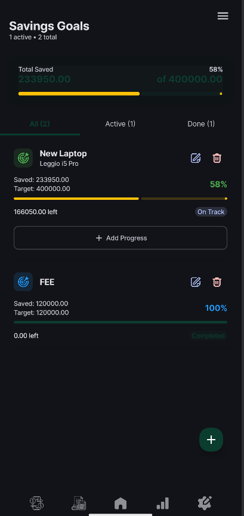
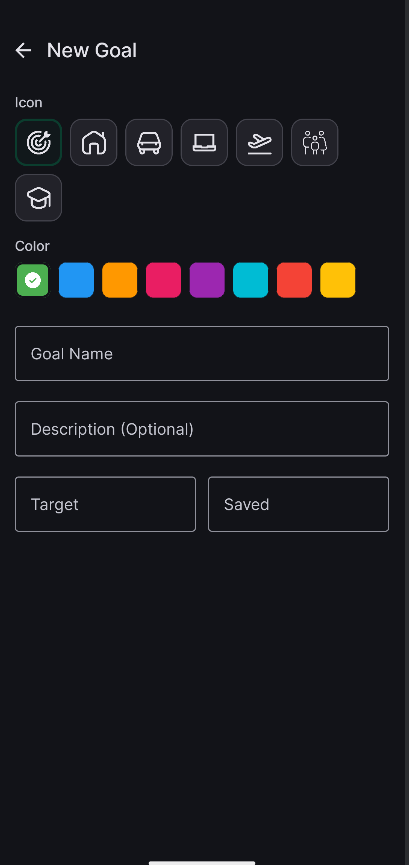
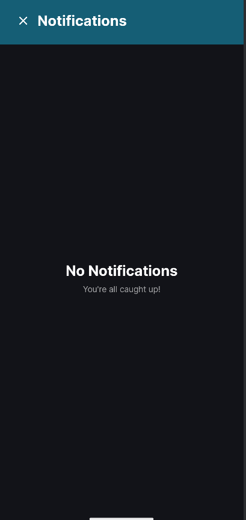
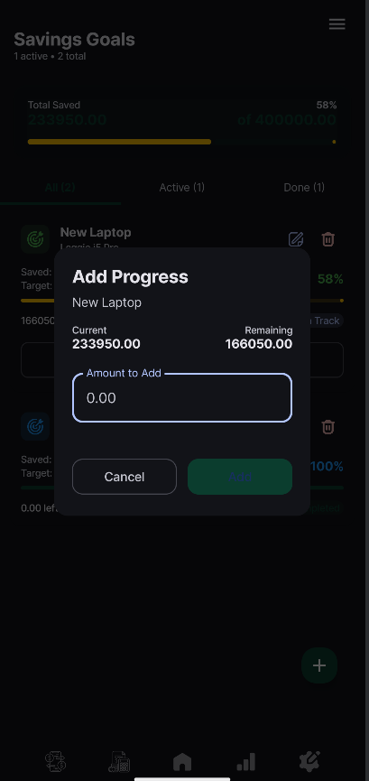

  

  <h1 align="center">Ledgerly</h1>
  
Know your money.

Ledgerly is a comprehensive personal finance management app built with modern Android technologies. It helps users gain full control over their financial life through tracking, budgeting, and goal setting with seamless cloud synchronization.

This project was developed as part of a class assignment.
You can view the original assignment instructions here:
[SCO 306 - Project 2 (PDF)](./SCO%20306%20-project%202.pdf)

## Screenshots (Dark Mode)

  
  
  
  

## Features

- **Transaction Management**: Effortlessly track income and expenses with detailed categorization and payment method logging.
- **Recurring Transactions**: Automate your frequent entries with flexible frequency settings (Daily, Weekly, Monthly, etc.).
- **Smart Budgeting**: Set monthly limits for different categories and monitor your spending habits in real-time.
- **Savings Goals**: Define financial targets, track progress, and stay motivated to save.
- **Cloud Sync**: Securely back up and sync your data across devices using Firebase.
- **Data Export**: Export your transaction history for external analysis.
- **Dark Mode Support**: A beautiful, eye-friendly interface designed for all lighting conditions.
- **Notifications**: Stay on top of your budget limits and recurring payments with timely alerts.

## Tech Stack

- **UI**: Jetpack Compose with Material 3
- **Language**: 100% Kotlin
- **Local Database**: Room Persistence Library
- **Backend/Sync**: Firebase (Firestore & Auth)
- **Dependency Injection**: Hilt
- **Background Tasks**: WorkManager (for recurring transactions)
- **Architecture**: MVVM (Model-View-ViewModel)

## Getting Started

1. Clone the repository.
2. Add your `google-services.json` to the `app/` directory.
3. Build and run using.
